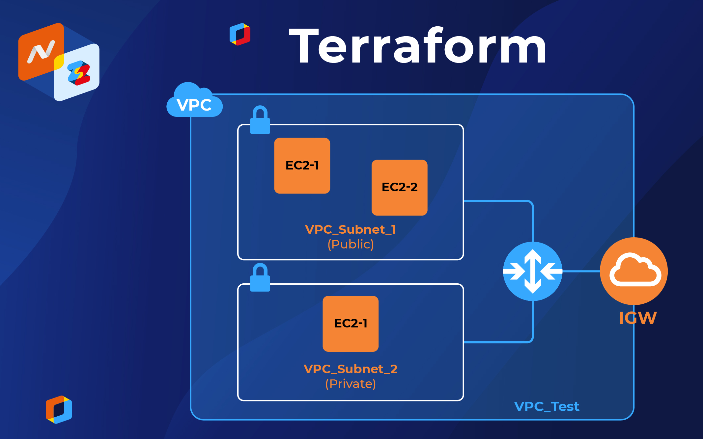

## Terrafrom infrastructure setup with Private and Public subnets, using NAT and GW

#### You would need to create key "ec2" in your AWS account first in order to connect to your EC2 instances
#### Update your .ssh/config file
Host bastion-instance \
HostName <Bastion Public IP> \
User ec2-user \
Host private-instance \
   HostName <Private IP> \
   User ec2-user \
   ProxyCommand ssh -q -W %h:%p bastion-instance
#### Add the PEM "ec2" File to the keychain
  ssh-add ec2.pem
#### Check the keychain
  ssh-add -l
#### Now you can login without using the -i parameter.
  ssh ec2-user@public-ec2-instance
#### Check the keychain on the remote host
  ssh-add -l
#### And connect to the the private-ec2-instance
  ssh private-ec2-instance

